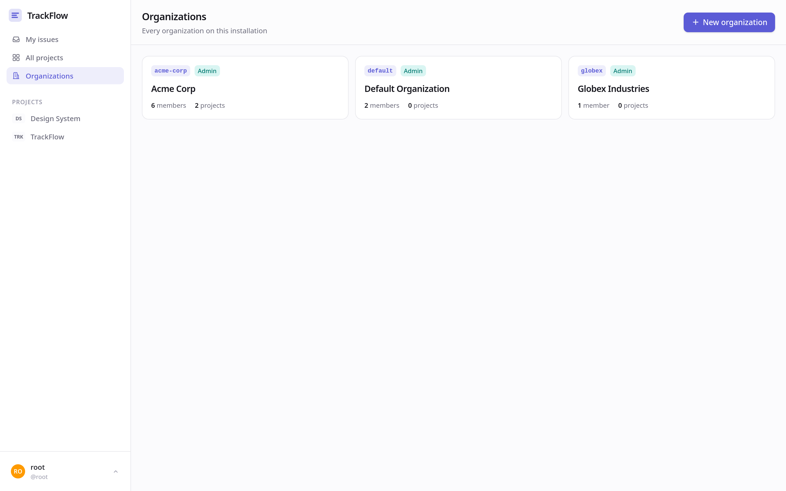
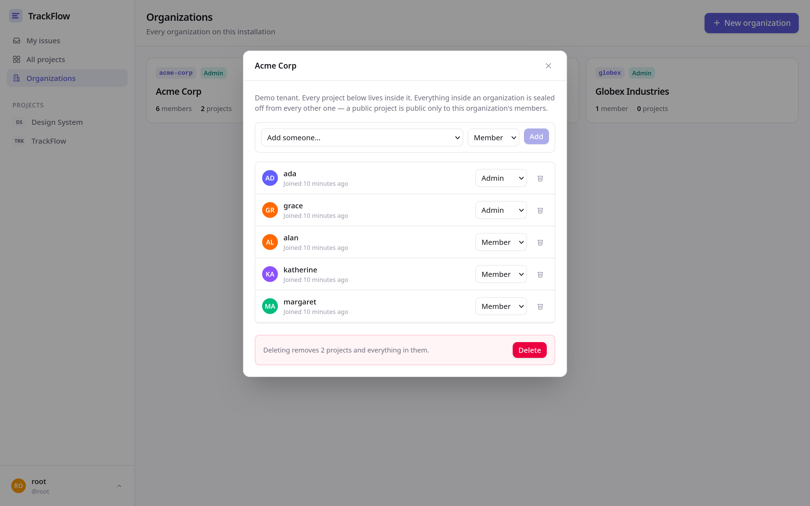
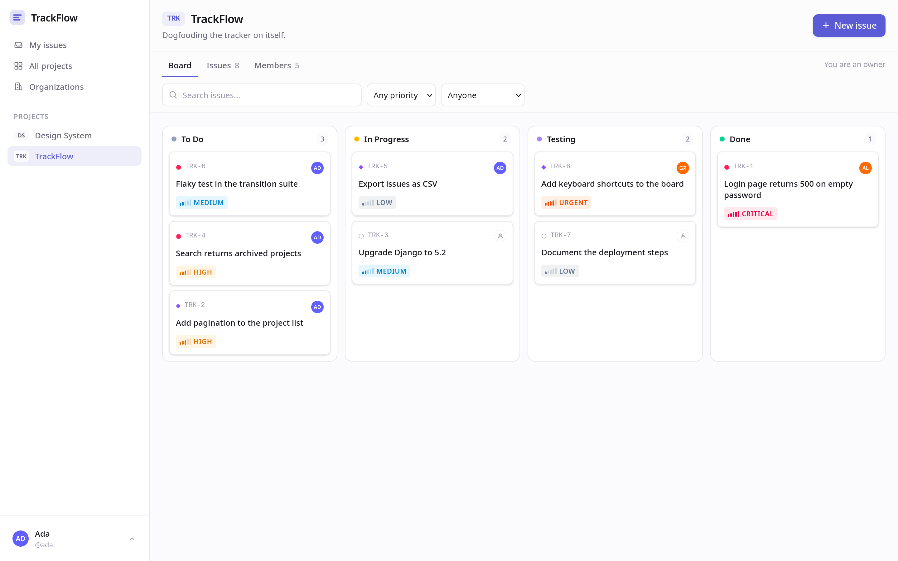
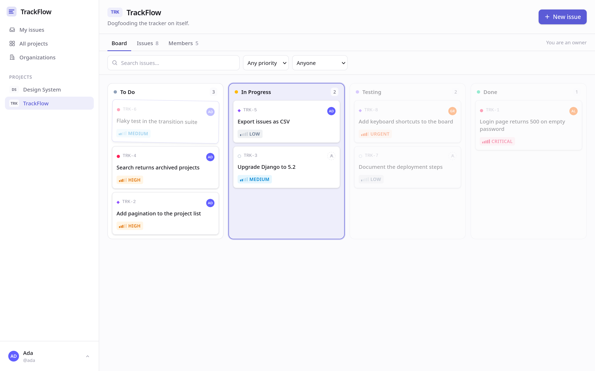
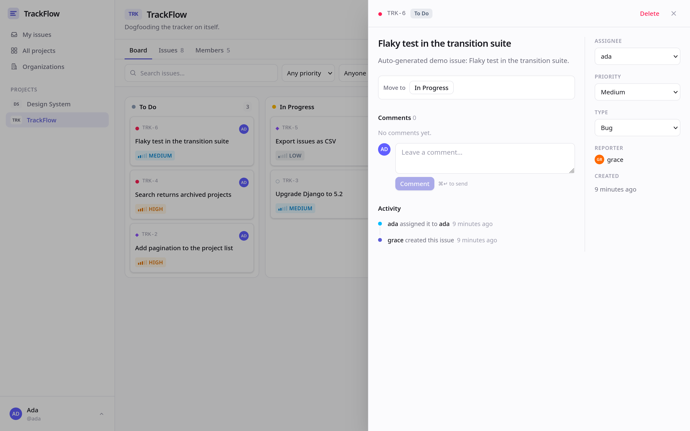
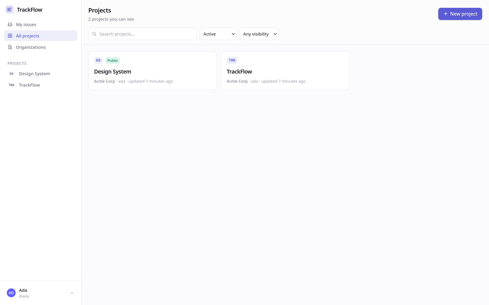
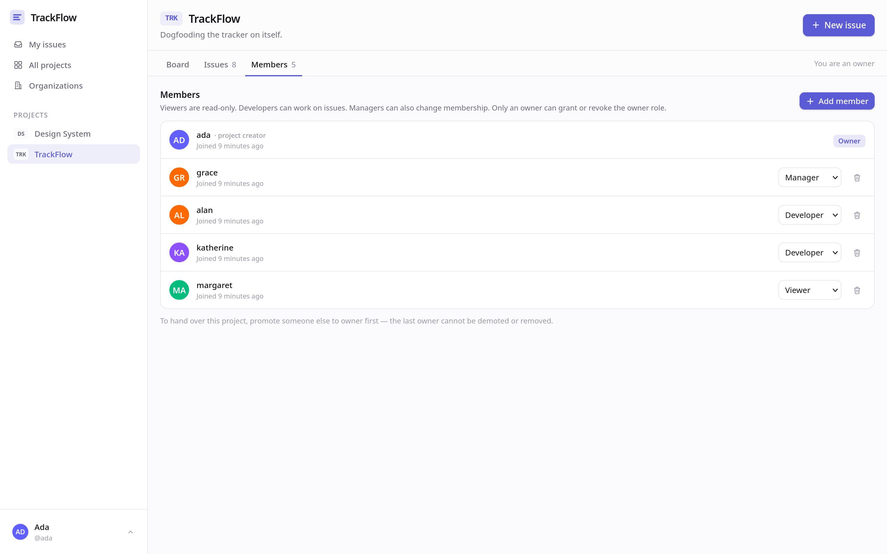
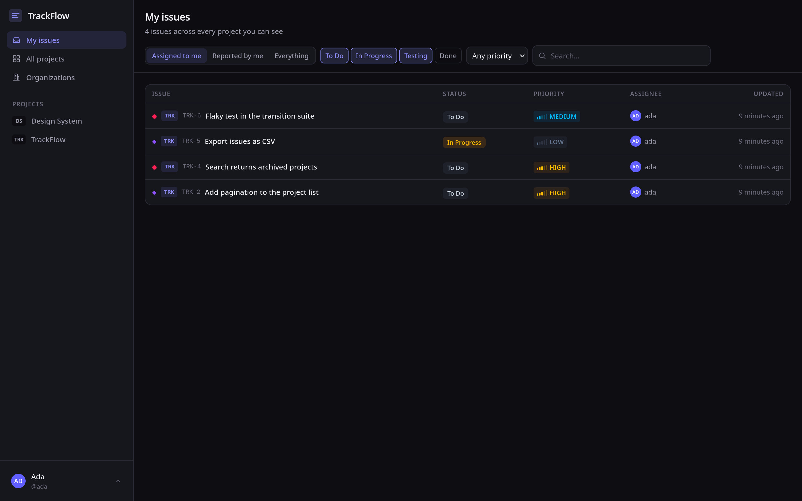
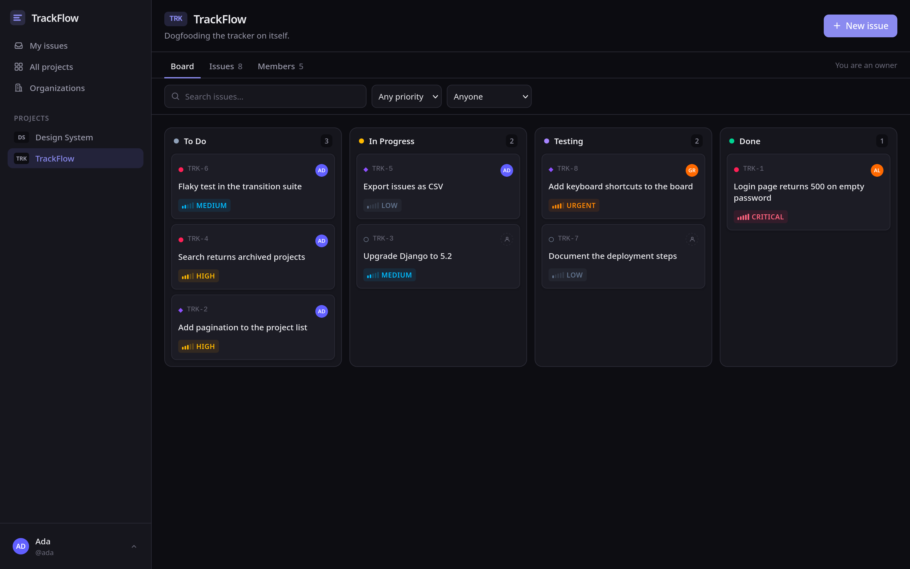
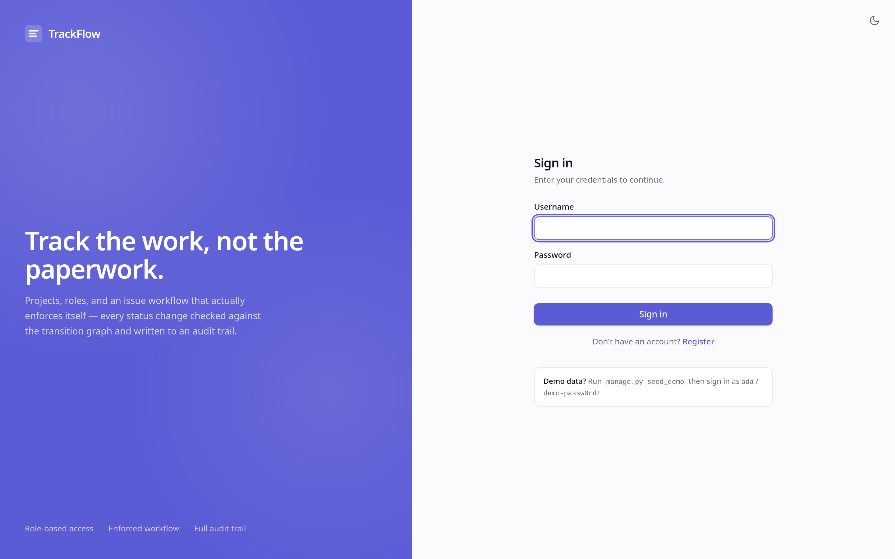

# TrackFlow

A project and issue tracking backend — a lightweight Jira/Linear-style REST API
built with **Django 5.2** and **Django REST Framework**.

Multi-tenant: organizations hold projects, projects have role-based membership,
issues follow an enforced status workflow, and everything is written to an
append-only audit trail — behind JWT authentication, with an OpenAPI schema and
219 tests.

Ships with a **React single-page UI** (`frontend/`): a kanban board where the
drag targets are the backend's own transition graph, cross-project issue search,
and membership management. See [frontend/README.md](frontend/README.md).

---

## Table of contents

- [Screenshots](#screenshots)
- [Quick start](#quick-start)
- [The UI](#the-ui)
- [Architecture](#architecture)
- [Data model](#data-model)
- [Permissions](#permissions)
- [API reference](#api-reference)
- [Configuration](#configuration)
- [Testing](#testing)
- [Design notes](#design-notes)
- [What is not built](#what-is-not-built)

---

## Screenshots

Captured from the running app against seeded demo data.

### Organizations — the tenant layer

A super admin creates organizations and appoints each one an admin. Every
project lives inside exactly one, and nothing crosses the boundary.



Org admins manage their own roster. The last admin cannot be demoted or removed,
so an organization can never be left without one.



### The board

Kanban for one project. Cards carry type, key, priority and assignee.



**The transition graph is the drag target.** The moment a drag begins, columns
the status graph forbids are dimmed — here a `To Do` card can only go to
`In Progress`, so `Testing` and `Done` fade out and refuse the drop.



### Issue detail

Description, assignee, priority and type, with comments and the activity
timeline rendered from the audit trail. The "Move to" buttons come straight from
the API's `allowed_transitions`.



### Projects and membership





### Cross-project view and dark theme

Every issue you can see, across every project, in either theme.





### Sign in



---

## Quick start

Requires **Python 3.11** and [uv](https://github.com/astral-sh/uv).

```bash
cd TrackFlow

uv sync                        # install dependencies into .venv
cp .env.example .env           # local config — this is what turns DEBUG on
uv run manage.py migrate
uv run manage.py createsuperuser   # your super admin — creates organizations
uv run manage.py seed_demo     # optional: realistic sample data
uv run manage.py runserver
```

| | |
|---|---|
| Swagger UI | <http://127.0.0.1:8000/api/docs/> |
| ReDoc | <http://127.0.0.1:8000/api/redoc/> |
| OpenAPI schema | <http://127.0.0.1:8000/api/schema/> |
| Django admin | <http://127.0.0.1:8000/admin/> |

`seed_demo` creates an organization (**Acme Corp**) with five users — `ada`,
`grace`, `alan`, `katherine`, `margaret`, all with password `demo-passw0rd!` —
holding one project role each, plus a public project and a spread of issues.
`ada` and `grace` are its org admins. It refuses to run when `DEBUG=False`.

Because everything lives inside an organization, a brand-new user sees nothing
until a super admin puts them in one.

Getting a token and using it:

```bash
TOKEN=$(curl -s -X POST localhost:8000/api/auth/login/ \
  -H 'Content-Type: application/json' \
  -d '{"username":"ada","password":"demo-passw0rd!"}' | jq -r .access)

curl -s localhost:8000/api/projects/ -H "Authorization: Bearer $TOKEN"
```

> **On `DEBUG`:** it defaults to `False`, so an environment that sets nothing is
> safe rather than exposed. That also means `runserver` will not serve static
> files and the admin will render unstyled until you create the `.env` above.

---

## The UI

A React + TypeScript SPA lives in [`frontend/`](frontend/). Run it alongside the
API:

```bash
# terminal 1 — API
uv run manage.py runserver          # http://127.0.0.1:8000

# terminal 2 — UI
cd frontend && npm install && npm run dev   # http://localhost:5173
```

Vite proxies `/api` to Django, so both sides share one origin and **the backend
needs no CORS configuration**.

What it gives you:

| | |
|---|---|
| **Board** | Kanban with drag-to-transition. The moment a drag starts, columns that the status graph forbids are dimmed — so an illegal move is visibly impossible. Drops are optimistic and roll back if the server rejects them. |
| **Issue panel** | Slide-over with inline editing, assignee/priority/type, comments, and the activity timeline rendered from the audit trail. Its "Move to" buttons come straight from the API's `allowed_transitions`. |
| **My issues** | Every issue you can see across all projects, filtered by assigned/reported, status and priority. |
| **Members** | Add, re-role and remove people, with the last-owner rule reflected in the controls. |
| **Themes** | Light and dark, from the system preference, remembered per browser. |

Write controls are hidden for roles that cannot use them — but that is courtesy,
not security. Permissions are enforced by the API; the UI only avoids offering
actions that would 403.

For a production bundle: `cd frontend && npm run build` emits static files to
`frontend/dist/`, ready to serve from any web server or CDN.

---

## Architecture

TrackFlow follows a **layered service/selector** architecture (the HackSoft
Django styleguide pattern). Business logic lives outside views and outside
serializers, which keeps views thin and makes the rules testable directly.

```
HTTP request
    │
    ▼
api/urls.py ──► api/views.py            # thin: auth, status codes, wiring
                    │
        ┌───────────┼───────────┬──────────────────┐
        ▼           ▼           ▼                  ▼
 api/serializers  api/permissions  services/*.py   selectors/*.py
 validation and   who may write    writes, txns,   reads, querysets,
 output shape                      invariants      visibility scoping
                                        │                │
                                        └────────┬───────┘
                                                 ▼
                                            models.py
```

| Layer | Responsibility | Must not |
|---|---|---|
| `api/views.py` | HTTP concerns: status codes, request/response | Contain business logic or ORM queries |
| `api/serializers.py` | Input validation and output shape | Perform writes — `.create()`/`.update()` are bypassed |
| `api/permissions.py` | Object-level authorisation (who may write) | Filter querysets — that is the selector's job |
| `api/filters.py` | Query parameters for list endpoints | Enforce visibility |
| `services/` | Writes, transactions, invariants, audit rows | Know about HTTP |
| `selectors/` | Reads, querysets, **visibility scoping** | Perform writes |
| `models.py` | Fields, constraints, `__str__`, pure helpers | Orchestrate |

**The one rule worth internalising:** *visibility* is enforced in selectors and
*authorisation* in permissions. That split is what makes an invisible object
return `404` (it must not leak its existence) while a visible-but-unwritable one
returns `403`.

### Project layout

```
TrackFlow/
├── manage.py
├── pyproject.toml               # deps + ruff config
├── .env.example                 # every supported env var
│
├── trackflow/
│   ├── settings.py              # env-driven; DRF, JWT, OpenAPI config
│   └── urls.py
│
├── accounts/                    # registration, JWT, profile
│   ├── api/{serializers,views,urls}.py
│   ├── services/user_service.py
│   ├── selectors/user_selector.py
│   └── tests.py                 # 24 tests
│
├── organizations/               # the tenant layer
│   ├── models.py                # Organization, OrgMember
│   ├── api/
│   │   ├── serializers.py
│   │   ├── permissions.py       # IsSuperAdmin, OrganizationPermission
│   │   ├── views.py
│   │   └── urls.py
│   ├── services/org_service.py  # last-admin rule lives here
│   ├── selectors/org_selector.py
│   ├── testing.py               # make_org / make_user helpers for all suites
│   └── tests.py                 # 50 tests, incl. tenant isolation
│
├── projects/                    # projects + membership
│   ├── models.py                # Project, ProjectMember
│   ├── api/
│   │   ├── serializers.py
│   │   ├── permissions.py       # ProjectPermission
│   │   ├── filters.py
│   │   ├── views.py             # project CRUD
│   │   ├── member_views.py      # membership management
│   │   └── urls.py
│   ├── services/{project,member}_service.py
│   ├── selectors/{project,member}_selector.py
│   ├── management/commands/seed_demo.py
│   ├── tests.py                 # 44 tests
│   ├── test_members.py          # 26 tests
│   └── test_queries.py          #  4 query-count guards
│
└── issues/                      # issues, comments, activity
    ├── models.py                # Issue, Comment, IssueActivity
    ├── api/
    │   ├── serializers.py
    │   ├── permissions.py       # IssuePermission, CommentPermission
    │   ├── filters.py           # IssueFilter
    │   ├── views.py
    │   └── urls.py
    ├── services/issue_service.py
    ├── selectors/issue_selector.py
    └── tests.py                 # 71 tests
```

---

## Data model

```
   ┌──────────────────────────────┐      ┌──────────────────┐
   │        Organization          │─────►│    OrgMember     │
   │  name, slug (unique)         │      │  ADMIN / MEMBER  │
   │  description, is_active      │      │  UNIQUE(org,usr) │
   └──────┬───────────────────────┘      └──────────────────┘
          │ projects
          ▼
                    ┌───────────────┐
                    │   auth.User   │
                    └───┬───┬───┬───┘
             owner (FK) │   │   │ reporter / assignee (SET_NULL)
                        ▼   │   │
   ┌────────────────────────┴───┼──────────────┐
   │         Project            │              │
   │  organization (FK)         │              │
   │  name, key (unique)        │              │
   │  description, status       │              │
   │  visibility, issue_counter │              │
   └──────┬─────────────────────┼──────────────┘
          │ members             │ issues
          ▼                     ▼
   ┌──────────────────┐   ┌──────────────────────────────┐
   │  ProjectMember   │   │           Issue              │
   │  role, joined_at │   │  number, title, description  │
   │  UNIQUE(proj,usr)│   │  type, status, priority      │
   └──────────────────┘   │  closed_at                   │
                          │  UNIQUE(project, number)     │
                          └────┬────────────────┬────────┘
                    comments   │                │ activities
                               ▼                ▼
                    ┌──────────────────┐  ┌──────────────────┐
                    │     Comment      │  │  IssueActivity   │
                    │  author, body    │  │  actor, action,  │
                    │                  │  │  field, old, new │
                    └──────────────────┘  └──────────────────┘
                                            append-only
```

### `Organization`

The tenant. Only a super admin (`User.is_superuser`) can create or delete one.

| Field | Type | Notes |
|---|---|---|
| `name` | `CharField(200)` | |
| `slug` | `SlugField(50)` | **unique**, immutable — identifies the tenant in URLs |
| `description` | `TextField` | optional |
| `is_active` | `BooleanField` | `False` hides the org and everything in it from members, reversibly |

### `OrgMember`

`role` is `ADMIN` or `MEMBER`, with `unique_together(organization, user)`.
Deliberately only two roles: this layer answers one question — may you see
anything in this tenant at all — plus who administers the roster. Fine-grained
permissions stay at the project level.

### `Project`

| Field | Type | Notes |
|---|---|---|
| `organization` | `FK(Organization)` | the tenant; **cannot be changed** after creation |
| `name` | `CharField(200)` | |
| `key` | `CharField(10)` | **unique**, required — board key, e.g. `TRK` |
| `description` | `TextField` | optional |
| `owner` | `FK(User)` | cascade delete |
| `status` | choice | `ACTIVE` (default) / `ARCHIVED` |
| `visibility` | choice | `PRIVATE` (default) / `PUBLIC` |
| `issue_counter` | `PositiveIntegerField` | last issue number handed out |

### `ProjectMember`

`role` is one of `OWNER` / `MANAGER` / `DEVELOPER` / `VIEWER`, with
`unique_together(project, user)` — one role per person per project.

Creating a project always creates an `OWNER` membership for the creator. If the
creator also appears in the request's `members` array they are skipped, so no
duplicate is attempted.

### `Issue`

Publicly identified by `key` — the project key plus a per-project counter, e.g.
`TRK-1`. Indexed on `(project, status)` and `(assignee)`.

| Field | Notes |
|---|---|
| `number` | per-project counter; `unique_together(project, number)` |
| `type` | `TASK` / `BUG` / `FEATURE` / `CHORE` |
| `status` | `TODO` / `IN_PROGRESS` / `TESTING` / `DONE` |
| `priority` | `LOW` / `MEDIUM` / `HIGH` / `URGENT` / `CRITICAL` |
| `reporter`, `assignee` | `SET_NULL` — see [Design notes](#deleting-a-user-never-deletes-the-record) |
| `closed_at` | set on entering `DONE`, cleared on leaving |

### The status workflow

Status changes are not free-form. The service layer enforces this graph:

```
   ┌──────┐        ┌─────────────┐        ┌─────────┐        ┌──────┐
   │ TODO │ ─────► │ IN_PROGRESS │ ─────► │ TESTING │ ─────► │ DONE │
   └──────┘ ◄───── └─────────────┘ ◄───── └─────────┘        └──────┘
                          ▲                                      │
                          └──────────────────────────────────────┘
                                        reopen
```

`TODO → DONE` is rejected with a `400`. A transition to the current status is a
no-op and writes no audit row. `GET /api/issues/<id>/` returns
`allowed_transitions`, so a client can render only the buttons that will work.

---

## Permissions

Authorisation is two independent gates, and **both** must pass:

```
        ┌─────────────────────────────────────────────┐
        │ 1. TENANT  — are you in the org, and is it   │
        │              active?          (selector)    │
        └───────────────────┬─────────────────────────┘
                            ▼
        ┌─────────────────────────────────────────────┐
        │ 2. PROJECT — member, owner, or is it PUBLIC? │
        │                               (selector)    │
        └───────────────────┬─────────────────────────┘
                            ▼
        ┌─────────────────────────────────────────────┐
        │ 3. ROLE    — may you WRITE this?             │
        │                             (permission)    │
        └─────────────────────────────────────────────┘
```

Gates 1 and 2 are applied in **selectors**, so failing either makes the object
simply absent and the view returns `404`. Gate 3 is a **permission**, so failing
it returns `403`. That is why a private project never leaks its existence, while
a visible-but-unwritable one gives an honest refusal.

**`PUBLIC` means public within its organization, never outside it.**

### Organization roles

| Action | Super admin | Org ADMIN | Org MEMBER | Outsider |
|---|:---:|:---:|:---:|:---:|
| Create an organization | ✅ | — | — | — |
| Delete an organization | ✅ | — | — | — |
| Rename / deactivate it | ✅ | ✅ | — | — |
| Add / remove / re-role members | ✅ | ✅ | — | — |
| See the roster | ✅ | ✅ | ✅ | — |
| Create a project inside it | ✅ | ✅ | ✅ | — |

A super admin is Django's `is_superuser`, so `createsuperuser` is all it takes
to make one and the same account already works in `/admin/`. They see every
organization: they hold full database access through the admin anyway, so
withholding rows in the API would be theatre rather than security.

An organization always keeps at least one `ADMIN` — demoting or removing the
last one returns `400`, exactly like the last-owner rule on projects.

### Project roles

Read access mirrors project visibility. Write access follows the role table.

| Action | OWNER | MANAGER | DEVELOPER | VIEWER | Non-member |
|---|:---:|:---:|:---:|:---:|:---:|
| See project & its issues | ✅ | ✅ | ✅ | ✅ | only if `PUBLIC` |
| Edit project | ✅ | ✅ | — | — | — |
| Delete project | ✅ | — | — | — | — |
| Add / remove / re-role members | ✅ | ✅ ¹ | — | — | — |
| Create & edit issues | ✅ | ✅ | ✅ | — | — |
| Transition & assign issues | ✅ | ✅ | ✅ | — | — |
| Delete an issue | ✅ | ✅ | own only ² | — | — |
| Comment | ✅ | ✅ | ✅ | — | — |
| Edit a comment | author only | author only | author only | — | — |
| Delete a comment | ✅ any | ✅ any | own only | — | — |

¹ A manager cannot grant, revoke or remove the `OWNER` role — only an owner can.
² The issue's reporter may delete their own issue.

Two invariants are enforced in the service layer rather than the view:

- **A project always keeps at least one `OWNER`.** Demoting or removing the last
  one returns `400`. Ownership is transferred by promoting a successor, then
  stepping down.
- **A `VIEWER` is read-only everywhere**, including comments.

The project owner passes every check even without a `ProjectMember` row, so a
project created through the Django admin stays manageable by its owner.

---

## API reference

Base URL `/api/`. All endpoints require authentication; list endpoints are
paginated at 20 per page (`?page=2`) and return
`{count, next, previous, results}`.

Full interactive documentation is at **`/api/docs/`**.

### Authentication

| Method | Path | Description |
|---|---|---|
| `POST` | `/api/auth/register/` | Create an account; returns the user and a token pair |
| `POST` | `/api/auth/login/` | Exchange credentials for `access` + `refresh` |
| `POST` | `/api/auth/refresh/` | Exchange a refresh token for a new pair |
| `POST` | `/api/auth/verify/` | Check whether a token is still valid |
| `GET`/`PATCH` | `/api/auth/me/` | Own profile — `username` is immutable |
| `POST` | `/api/auth/change-password/` | Requires the current password |
| `GET` | `/api/auth/users/` | Active-user directory, `?search=` |

Send the access token as `Authorization: Bearer <token>`. Registration and login
are rate-limited to 20 requests/hour.

### Organizations

| Method | Path | Description |
|---|---|---|
| `GET` | `/api/organizations/` | The ones you belong to — all of them, for a super admin |
| `POST` | `/api/organizations/` | **Super admin only.** `admin` names its first admin (defaults to you) |
| `GET` | `/api/organizations/<id>/` | Detail, with the nested roster and your role |
| `PATCH` | `/api/organizations/<id>/` | Super admin or org admin. `slug` is immutable |
| `DELETE` | `/api/organizations/<id>/` | **Super admin only** — cascades to every project inside |
| `GET`/`POST` | `/api/organizations/<id>/members/` | Roster / add someone |
| `PATCH`/`DELETE` | `/api/organizations/<id>/members/<member_id>/` | Re-role / remove |

```bash
# create a tenant and hand it to someone
curl -X POST localhost:8000/api/organizations/ \
  -H "Authorization: Bearer $SUPER_ADMIN_TOKEN" \
  -H 'Content-Type: application/json' \
  -d '{"name":"Acme Corp","slug":"acme-corp","admin":7}'
```

### Projects

| Method | Path | Description |
|---|---|---|
| `GET` | `/api/projects/` | Projects visible to the caller, across all their orgs |
| `POST` | `/api/projects/` | Create; **`organization` is required** and you must belong to it. Caller becomes `OWNER` |
| `GET` | `/api/projects/<id>/` | Detail, with nested members |
| `PATCH` | `/api/projects/<id>/` | `key` and `members` are not editable here |
| `DELETE` | `/api/projects/<id>/` | Cascades to members and issues |

Filters: `?search=`, `?status=`, `?visibility=`, `?key=`, `?owner_username=`,
`?organization=`, `?organization_slug=`, `?ordering=name`.

### Membership

| Method | Path | Description |
|---|---|---|
| `GET` | `/api/projects/<id>/members/` | List members and roles |
| `POST` | `/api/projects/<id>/members/` | Add a member |
| `PATCH` | `/api/projects/<id>/members/<member_id>/` | Change a role |
| `DELETE` | `/api/projects/<id>/members/<member_id>/` | Remove a member |

### Issues

| Method | Path | Description |
|---|---|---|
| `GET` | `/api/issues/` | Every issue the caller can see, across projects |
| `GET`/`POST` | `/api/projects/<id>/issues/` | Scoped to one project |
| `GET`/`PATCH`/`DELETE` | `/api/issues/<id>/` | `PATCH` cannot change `status` |
| `POST` | `/api/issues/<id>/transition/` | `{"status": "IN_PROGRESS"}` |
| `POST` | `/api/issues/<id>/assign/` | `{"assignee": 3}` — `null` unassigns |
| `GET` | `/api/issues/<id>/activity/` | Audit trail, newest first |
| `GET`/`POST` | `/api/issues/<id>/comments/` | |
| `GET`/`PATCH`/`DELETE` | `/api/comments/<id>/` | |

Filters: `?status=` (repeatable), `?priority=`, `?type=`, `?assignee_username=`,
`?reporter_username=`, `?project_key=`, `?unassigned=true`, `?created_after=`,
`?search=`, `?ordering=number`.

```bash
# my open, high-priority work across every project
GET /api/issues/?assignee_username=ada&status=TODO&status=IN_PROGRESS&priority=HIGH
```

### Example: issue detail

```json
{
  "id": 12,
  "key": "TRK-4",
  "project": 1,
  "project_key": "TRK",
  "title": "Search returns archived projects",
  "description": "...",
  "type": "BUG",
  "status": "IN_PROGRESS",
  "priority": "HIGH",
  "reporter": { "id": 1, "username": "ada", "email": "ada@example.com",
                "first_name": "Ada", "last_name": "Lovelace" },
  "assignee": { "id": 3, "username": "alan", "...": "..." },
  "comments": [
    { "id": 5, "issue": 12, "author": { "id": 3, "username": "alan" },
      "body": "Picking this up today.", "created_at": "...", "updated_at": "..." }
  ],
  "activities": [
    { "id": 9, "actor": "alan", "action": "STATUS_CHANGED", "field": "status",
      "old_value": "TODO", "new_value": "IN_PROGRESS", "created_at": "..." }
  ],
  "allowed_transitions": ["TESTING", "TODO"],
  "created_at": "...", "updated_at": "...", "closed_at": null
}
```

### Error shape

Field errors are always **lists of strings**, matching DRF's serializer errors:

```json
{ "status": ["Cannot move an issue from TODO to DONE. Allowed from TODO: ['IN_PROGRESS']."] }
```

| Code | Meaning |
|---|---|
| `400` | Validation error, or a rejected transition / last-owner removal |
| `401` | Missing or invalid token |
| `403` | Visible, but your role does not permit this write |
| `404` | Does not exist, **or** you cannot see it |

---

## Configuration

Every setting is read from the environment; see `.env.example`.

| Variable | Default | Notes |
|---|---|---|
| `DJANGO_SECRET_KEY` | insecure dev fallback | **≥ 32 bytes** — it signs JWTs |
| `DEBUG` | `False` | `.env.example` sets it to `True` for local work |
| `ALLOWED_HOSTS` | loopback names | Comma-separated |
| `DATABASE_URL` | local sqlite | e.g. `postgres://user:pw@host:5432/trackflow` |
| `JWT_ACCESS_MINUTES` | `60` | |
| `JWT_REFRESH_DAYS` | `7` | Refresh tokens rotate on use |

---

## Testing

```bash
uv run manage.py test              # 219 tests, ~3s
uv run manage.py test issues       # one app
uv run ruff check .                # lint
```

| Suite | Tests | Covers |
|---|--:|---|
| `accounts.tests` | 24 | Registration, password hashing and validation, the full JWT lifecycle over real HTTP headers, profile updates, privilege-escalation attempts |
| `organizations.tests` | 50 | Org CRUD and who may do it, roster management, the last-admin rule, and **tenant isolation** — 15 cases proving nothing crosses an org boundary |
| `projects.tests` | 44 | Project CRUD, serializer shapes, visibility scoping, role-based writes, filtering and search |
| `projects.test_members` | 26 | Adding, re-roling and removing members; the last-owner invariant; ownership transfer |
| `projects.test_queries` | 4 | Query-count guards against N+1 regressions |
| `issues.tests` | 71 | Issue keys and counters, CRUD, the transition graph, assignment, comments, the audit trail, filtering, null serialization, error shapes |

Test runs swap in a fast password hasher (see the bottom of `settings.py`),
which takes the suite from ~66s to ~2s. It has no effect on a real deployment.

---

## Design notes

Decisions that are not obvious from reading the code.

### Serializers never write

`.create()` and `.update()` are deliberately unused. Every write goes through a
service function, which is what lets `create_project` create the project *and*
its owner membership in one transaction, and lets every issue mutation write an
audit row without each view remembering to.

### Issue numbers come from a counter, not `MAX(number) + 1`

`Project.issue_counter` is incremented with an atomic `F()` expression, so two
concurrent creates cannot read the same value. `unique_together(project, number)`
is the backstop. A side effect: deleting `TRK-3` does not free the number 3 — the
next issue is still `TRK-4`. Retiring numbers is correct for a tracker, where a
key that has appeared in a commit message or a link must never be reused.

### Deleting a user never deletes the record

`Issue.reporter`, `Issue.assignee`, `Comment.author` and `IssueActivity.actor`
are all `SET_NULL`. Deleting a person empties those links but leaves the issues,
comments and history intact. A tracker whose whole job is to keep a record must
not lose it because someone left.

Because those fields are nullable, every serializer field that traverses them
carries `default=None` — without it DRF *omits the key entirely* rather than
returning `null`, so the response shape would change depending on the data.

### Organizations are enforced in the selector, not sprinkled through views

The tenant check lives in one function — `_visible_to` in
`projects/selectors/project_selector.py`. Issues inherit it for free, because
`get_issues_for_user` filters on `project__in=get_projects_for_user(...)` rather
than repeating the rule. There is exactly one place to get this wrong, and one
place to fix it.

Removing someone from an organization also deletes their `ProjectMember` rows
inside it. Leaving them would mean a row granting access to a project they can
no longer reach — harmless while the outer gate holds, but an inconsistency
that resurfaces the moment they are re-added.

### `404` versus `403`

Selectors filter to what the caller may see, so an object they cannot see is
simply absent and the view raises `404`. Permissions then decide whether a
*visible* object may be written, raising `403`. A `PRIVATE` project therefore
never leaks its existence, while a `PUBLIC` one a stranger cannot edit gives an
honest `403`.

### Status is not a writable field

`PATCH /api/issues/<id>/` excludes `status` entirely. If it were writable, it
would be a way around the transition graph. Status changes go through
`POST /api/issues/<id>/transition/`, and the service raises rather than silently
ignoring an illegal move.

### The audit trail is append-only

`IssueActivity` rows are written only by the service layer, and the admin blocks
adding or changing them. Logging is defensive — values are stringified and
truncated to the column width — so an oversized title can never be the thing
that fails a write.

### `auth.User`, not a custom user model

Every foreign key points at `settings.AUTH_USER_MODEL` rather than `auth.User`,
so a custom model remains introducible later with a data migration. Adding one
now would mean rewriting the existing migration history for no present benefit.

---

## What is not built

Honest list of what a production deployment would still want:

- **File attachments on issues.** Needs a storage backend decision (local vs S3)
  and upload size/type policy, which is a deployment question more than a code one.
- **Token blacklisting on logout / password change.** Refresh tokens rotate, but
  an already-issued access token stays valid until it expires (default one hour).
  Needs `rest_framework_simplejwt.token_blacklist`.
- **Notifications.** No email or webhook on assignment or mention.
- **Labels, sprints, and issue-to-issue links** (blocks / duplicates).
- **Settings split** into `base/dev/prod`, a `docker-compose.yml`, and a CI
  workflow. Postgres needs only a `DATABASE_URL` — the settings already read one.
- **Bulk endpoints.** Every write is one object at a time.
- **Real-time updates in the UI.** The SPA refetches after writes and on a short
  stale window; there are no websockets, so another user's change lands on your
  next fetch.
- **Frontend tests.** The UI has none. The 219 API tests cover the rules it
  depends on.
